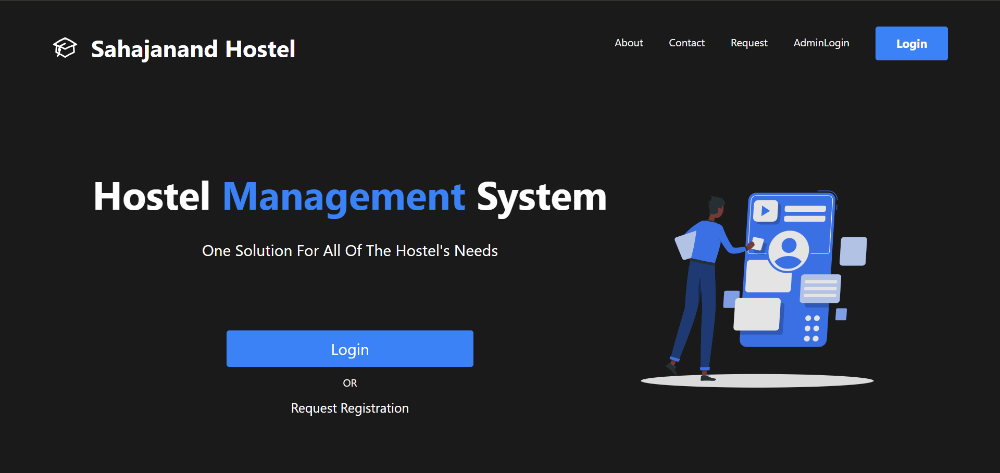
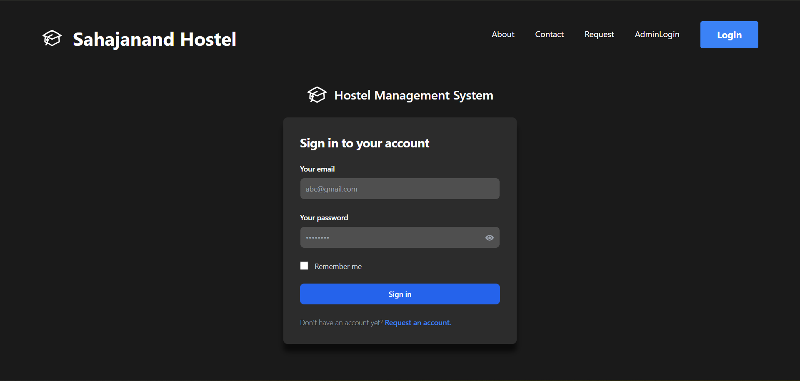
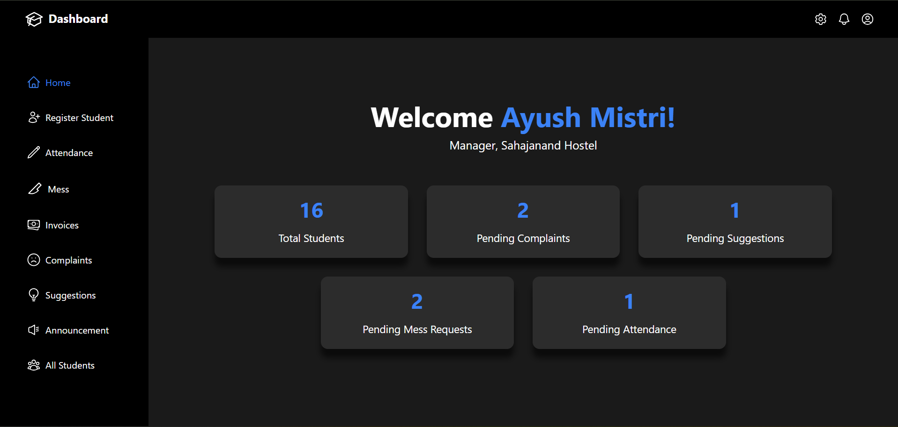
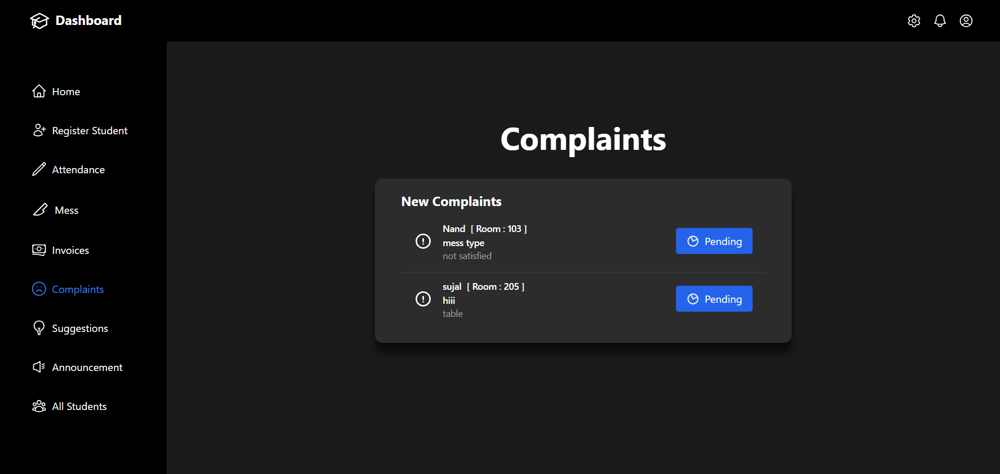
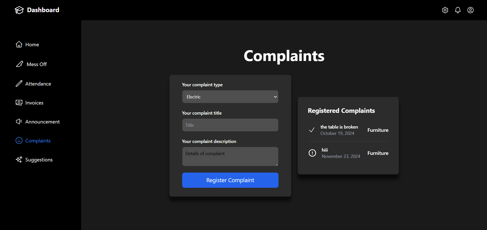
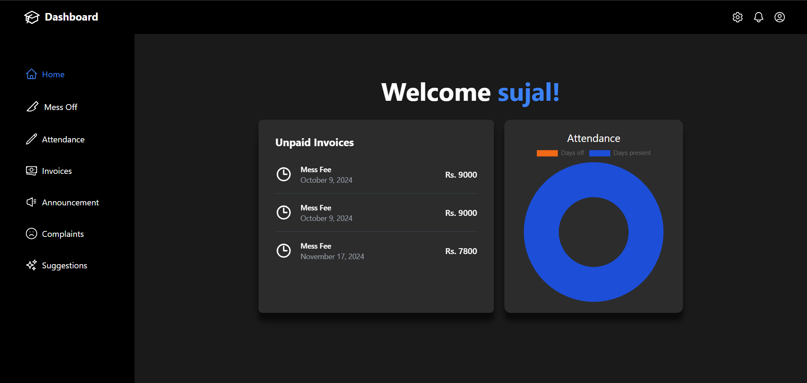

# Hostel Management System
It is a MERN stack application built for ease of hostel management.

## Features

- [x] Login/Signup
- [x] Admin Panel
    - Registration of new students
    - Marking attendance
    - Handeling complaints
    - Managing mess
    - Generating invoices
    - Handeling suggestions
- [x] Student Panel
    - Viewing attendance
    - Requesting mess off
    - Viewing invoices
    - Making complaints
    - Making suggestions

## Installation
Install [Node.js](https://nodejs.org/en/download) and [MongoDB](https://www.mongodb.com/try/download/community) on your system.

Clone the repository and install the dependencies.
```sh
cd client
npm i
```
```sh
cd ../server
npm i
```

```sh
cd ../
npm i -g concurrently
```

## Setup DB
- Create a mongodb database named `hostel`
- Create collections and given names like for `hostel.users.json` --> `users` in mongoCollections
- Add data by importing file like `hostel.users.json`

## Usage

```sh
npm run dev

```
## Project Screenshots







## Login Details
- AdminLogin
    - ayushmistri0203@gmail.com
    - Password: Ayush@0309
- Login
    - nand@gmail.com
    - Password: nand1234

## Add .env file in backend folder with following content
```
MONGO_URI="mongodb://127.0.0.1:27017/hostel"
```

## Contributing

Contributions are always welcome!😊


